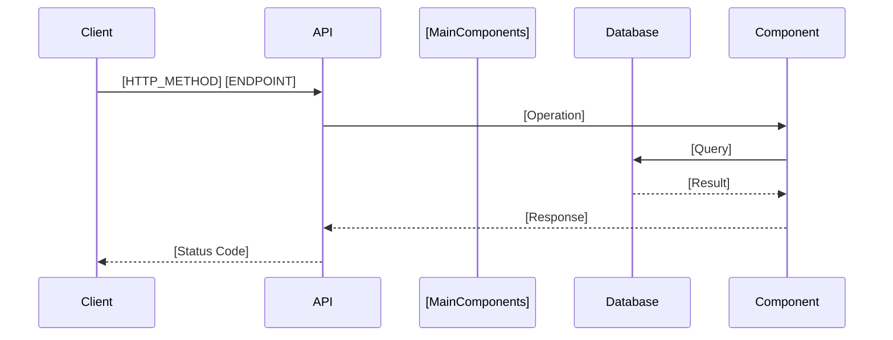
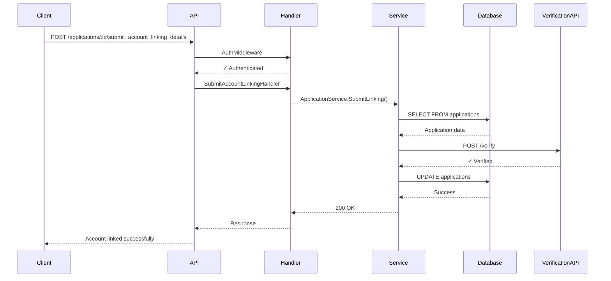

# API Flow Visualizer

Generate comprehensive flow visualizations for API endpoints in Go codebases, showing the complete execution path from request to response using both **Mermaid charts** (high-level, renderable diagrams) and **ASCII diagrams** (detailed view with file paths).

## Overview

This skill analyzes Go API endpoints and creates two types of visualizations:

**1. Mermaid Charts** - High-level, renderable diagrams:
- Can be rendered in GitHub, GitLab, Notion, VS Code, etc.
- Quick understanding of the overall flow
- Clean, professional appearance
- Shows main components and their interactions

**2. ASCII Diagrams** - Detailed, comprehensive view:
- File paths and line numbers for easy navigation
- All operations and components shown in detail
- Includes middleware, handlers, services, databases, external APIs
- Perfect for understanding implementation details

Both visualizations include:
- Middleware chain execution
- Handler and service layer calls
- Database queries and transactions
- External HTTP API calls
- Cache operations (Redis, Memcached, etc.)
- Message queue operations (Kafka, RabbitMQ, SQS, etc.)
- Conditional logic and branching
- Error handling paths
- Goroutines and parallel execution
- File paths and line numbers for easy navigation

## Workflow

### Step 1: Understand the Request

Extract the endpoint details from the user's request:
- HTTP method (GET, POST, PUT, DELETE, etc.)
- URL path (e.g., `/api/users/create`, `/accounts/:id`)
- Any specific details the user wants to focus on

If the endpoint is unclear, ask the user to clarify.

### Step 2: Locate the Route Definition

Search for the route definition in the codebase:

1. **Search for the URL path** in route definition files:
   - Common locations: `routes/`, `router/`, `api/`, `handlers/`, `cmd/`, `main.go`
   - Look for router frameworks (Gin, Echo, Chi, Gorilla Mux, Fiber, net/http)
   - See [go_patterns.md](references/go_patterns.md) for framework-specific route patterns

2. **Identify the handler function** associated with the route

3. **Capture middleware chain** if any middleware is registered for this route

**Search strategies:**
- Grep for the URL path pattern (e.g., `"/users/create"`, `"/accounts/:id"`)
- Look for HTTP method functions (e.g., `POST`, `router.POST`, `r.Post`)
- Check API versioning patterns (`/api/v1/`, `/v2/`)

### Step 3: Trace the Execution Flow

Starting from the handler, recursively trace through the execution:

1. **Read the handler function** and identify all operations
2. **Follow function calls** to services, repositories, utilities
3. **Identify external operations** using patterns from [go_patterns.md](references/go_patterns.md):
   - Database queries (GORM, sqlx, database/sql, MongoDB, etc.)
   - HTTP API calls (http.Client, resty, custom clients)
   - Cache operations (Redis, Memcached, in-memory caches)
   - Message queues (Kafka, RabbitMQ, SQS, Pub/Sub, NATS, NSQ)
4. **Track control flow**:
   - Conditional branches (if/else, switch)
   - Loops that may trigger multiple operations
   - Error handling and recovery paths
5. **Note async operations**:
   - Goroutines (`go func()`)
   - WaitGroups, channels
   - Context timeouts
6. **Record file locations**: Track file paths and line numbers for each component

**Important**:
- Read the actual code, don't assume behavior
- Follow the execution path chronologically
- Include both success and error paths when significant
- Note parallel operations (goroutines) explicitly

### Step 4: Categorize Components

As you trace the flow, categorize each operation:

- **Middleware**: Authentication, validation, rate limiting, CORS, logging
- **Handlers**: Request entry points
- **Services**: Business logic layer
- **Repositories**: Data access layer
- **Database**: SQL queries, NoSQL operations, transactions
- **Cache**: Get/Set operations, cache invalidation
- **HTTP Calls**: External API requests (payment gateways, notification services, etc.)
- **Queues**: Publish/consume operations, async job triggers
- **Utilities**: Validation, encryption, data transformation
- **External Libraries**: Third-party SDK calls

### Step 5: Generate the Visualizations

Generate **both** a Mermaid chart and an ASCII diagram for the API endpoint.

#### 5A. Generate Mermaid Chart (High-Level Overview)

Create a Mermaid sequence diagram using patterns from [mermaid_patterns.md](references/mermaid_patterns.md):

**Default: Use Sequence Diagram** for most API flows:


**Optional: Use Flowchart** when there's significant conditional logic:
- Shows decision points with diamond shapes
- Multiple branching paths
- Complex if/else logic

**Mermaid Requirements:**
- Show main components only (Client, API, Service, Database, ExternalAPI, Queue, Cache)
- Group similar operations together
- Focus on "what" happens, not "how"
- Use `alt/else` for conditional branches
- Use `par/and` for parallel operations
- Include notes for async boundaries
- Keep it simple and readable

**Output in code block:**
````markdown
```mermaid
[diagram here]
```
````

#### 5B. Generate ASCII Diagram (Detailed View)

Create a detailed ASCII diagram using patterns from [visualization_patterns.md](references/visualization_patterns.md):

**Visualization Styles:**

1. **Sequence Diagram (Default/Recommended)** - Use for most APIs
   - Shows component interactions over time with vertical timelines
   - Best for showing request/response flows between components
   - Clear visualization of middleware, handlers, services, databases, external APIs
   - Easy to see the chronological order of operations

2. **Flowchart** - Use for complex conditional logic
   - Shows decision trees with diamond-shaped decision points
   - Best when there are multiple branching paths (if/else logic)
   - Clear visualization of different execution paths

3. **Layered Architecture** - Use for complex systems
   - Shows components organized into architectural layers (API, Service, Data, etc.)
   - Best for microservices or systems with clear architectural boundaries
   - Provides a high-level overview of system structure

**ASCII Requirements:**
- Include file paths and line numbers: `(handlers/user.go:45)`
- Show chronological execution order (top-to-bottom)
- Label all components clearly (Client, API, Handler, Service, Database, Queue, etc.)
- Use proper ASCII box-drawing characters for clean diagrams
- Include HTTP status codes in responses
- Show query snippets for important database operations
- Mark external service URLs/endpoints
- Indicate transaction boundaries
- Show async operations (goroutines, background jobs) clearly
- Include ALL significant operations (comprehensive detail)
- Show both success and error paths when relevant
- Mark parallel operations explicitly
- Include all external dependencies (databases, caches, queues, APIs)

### Step 6: Present the Visualizations

Present the output in this order for best developer experience:

1. **Mermaid Chart First** - High-level overview
   - Show in a code block with `mermaid` language identifier
   - Allows rendering in GitHub, GitLab, Notion, VS Code, etc.
   - Gives quick understanding of the flow

2. **ASCII Diagram Second** - Detailed view
   - Show the comprehensive ASCII diagram
   - Includes all file paths and line numbers
   - Complete implementation details

3. **File References** - List of key files
   - Organized by layer (handlers, services, repos, etc.)
   - Include file path and line number
   - Brief description of what each does

4. **Summary** - High-level insights
   - Key services and components involved
   - External dependencies (APIs, databases, queues, caches)
   - Critical operations (database writes, external API calls, transactions)
   - Potential bottlenecks or areas of concern
   - Async operations and background jobs

5. **Optional: Offer to explore deeper**
   - Dive into specific functions in detail
   - Trace error paths comprehensively
   - Analyze performance implications
   - Generate diagrams for related endpoints
   - Show alternative flows (success vs. error paths)

## Best Practices

1. **Always read the actual code**: Never guess or assume implementation details
2. **Follow the real execution path**: Trace through actual function calls, not idealized flows
3. **Include file references**: Always provide file:line references for navigation
4. **Show actual names**: Use real function, service, and variable names from the codebase
5. **Track external dependencies**: Identify all external services, APIs, databases, caches, queues
6. **Note async operations**: Clearly indicate goroutines and background processing
7. **Provide context**: Help users understand what each component does
8. **Keep it readable**: Balance comprehensiveness with clarity

## Reference Files

- **[mermaid_patterns.md](references/mermaid_patterns.md)**: Mermaid chart patterns for high-level diagrams (sequence diagrams, flowcharts, architecture diagrams)
- **[visualization_patterns.md](references/visualization_patterns.md)**: ASCII diagram patterns for detailed views (sequence diagrams, flowcharts, layered architecture)
- **[go_patterns.md](references/go_patterns.md)**: Code patterns for identifying operations in Go (routes, database, HTTP, cache, queues)

Load these references as needed during the analysis process. Always generate both Mermaid and ASCII visualizations.

## Handling Different Scenarios

### Scenario 1: Endpoint Not Found
If the route cannot be found:
1. Search for similar patterns or partial matches
2. Ask the user to verify the endpoint path
3. Suggest checking API documentation or route files

### Scenario 2: Complex Multi-Service Architecture
For microservices or service-oriented architectures:
1. Trace HTTP calls to internal services
2. Note service boundaries clearly
3. Include service names and communication patterns
4. Show async/queue-based communication

### Scenario 3: Generated/Dynamic Routes
For dynamically registered routes:
1. Look for route registration code
2. Check framework-specific route builders
3. Search for URL patterns in documentation

### Scenario 4: Large/Complex Flows
For very large endpoints:
1. Generate the full comprehensive flow first
2. Offer to create focused views for specific sections
3. Highlight critical paths and decision points
4. Group similar operations when appropriate

## Tips for Accuracy

- **Framework-specific**: Recognize different Go web frameworks (Gin, Echo, Chi, Fiber, etc.)
- **ORM patterns**: Identify GORM, sqlx, database/sql patterns correctly
- **Client libraries**: Recognize popular HTTP clients (resty, standard library)
- **Queue libraries**: Identify Kafka (sarama), RabbitMQ (amqp), AWS SQS, etc.
- **Cache libraries**: Recognize go-redis, gomemcache, in-memory caches
- **Context propagation**: Track context.Context passing for tracing
- **Error wrapping**: Note error handling patterns (fmt.Errorf, pkg/errors)

## Example Interaction

**User**: "Show me the flow for POST /applications/:application_id/submit_account_linking_details"

**Process**:
1. Search for the route definition in the codebase
2. Identify the handler function
3. Trace through all function calls and operations
4. Categorize each operation type
5. Generate Mermaid chart (high-level) and ASCII diagram (detailed)
6. Present both visualizations with file references and summary

**Output Example:**

### High-Level Flow (Mermaid)



### Detailed Flow (ASCII)
```
POST /applications/:application_id/submit_account_linking_details
════════════════════════════════════════════════════════════════════════════════════

 Client      API       Handler         Service         Database    ExternalAPI
   │          │           │                │                │            │
   │  POST    │           │                │                │            │
   ├─────────>│           │                │                │            │
   │          │           │                │                │            │
   │          │ AuthMiddleware             │                │            │
   │          │ (middleware/auth.go:45)    │                │            │
   │          ├──────────>│                │                │            │
   │          │<──────────┤                │                │            │
   │          │           │                │                │            │
   │          │ SubmitAccountLinkingHandler│                │            │
   │          │ (handlers/application.go:123)               │            │
   │          ├──────────>│                │                │            │
   │          │           │                │                │            │
   │          │           │ ApplicationService.SubmitLinking│            │
   │          │           │ (services/application.go:234)   │            │
   │          │           ├───────────────>│                │            │
   │          │           │                │                │            │
   │          │           │                │ SELECT FROM    │            │
   │          │           │                │ applications   │            │
   │          │           │                ├───────────────>│            │
   │          │           │                │<───────────────┤            │
   │          │           │                │                │            │
   │          │           │                │ POST /verify   │            │
   │          │           │                ├───────────────────────────>│
   │          │           │                │                │            │
   │          │           │                │                │ ✓ Verified │
   │          │           │                │<───────────────────────────┤
   │          │           │                │                │            │
   │          │           │                │ UPDATE         │            │
   │          │           │                │ applications   │            │
   │          │           │                ├───────────────>│            │
   │          │           │                │<───────────────┤            │
   │          │           │                │                │            │
   │          │           │ 200 OK         │                │            │
   │          │           │<───────────────┤                │            │
   │          │           │                │                │            │
   │          │ 200 OK    │                │                │            │
   │          │<──────────┤                │                │            │
   │          │           │                │                │            │
   │<─────────┤           │                │                │            │
   │          │           │                │                │            │

File References:
• middleware/auth.go:45 - JWT authentication
• handlers/application.go:123 - SubmitAccountLinkingHandler
• services/application.go:234 - ApplicationService.SubmitLinking
• repos/application.go:156 - Database queries
• clients/verification.go:89 - External verification API
```

### Summary

**Components Involved:**
- API Gateway: Authentication middleware
- Handler: SubmitAccountLinkingHandler
- Service: ApplicationService
- Database: PostgreSQL (applications table)
- External API: Account Verification Service

**Key Operations:**
- Database SELECT: Fetch application details
- External API Call: Verify account linking details
- Database UPDATE: Update application status
- HTTP Response: 200 OK on success

**External Dependencies:**
- Account Verification API (external service)
- Database for application data persistence

**Flow Type:**
- Synchronous request/response
- No background jobs or async processing
- Single database transaction

The visualizations provide both a quick high-level overview (Mermaid) and detailed implementation view (ASCII) with file references for easy code navigation.
