# Mermaid Chart Patterns for API Flows

This reference provides patterns for generating Mermaid charts that create high-level, renderable diagrams for API endpoints. These charts can be rendered in GitHub, GitLab, Notion, and many other tools.

## Overview

Mermaid charts provide a **high-level overview** of API flows that can be rendered as actual diagrams. Use these alongside the detailed ASCII diagrams to give developers both:
- **Mermaid**: Quick understanding of the overall flow
- **ASCII**: Detailed view with file paths and line numbers

## Diagram Types

### 1. Sequence Diagram (Primary for APIs)

Best for showing request/response flows between components.

#### Simple API Flow

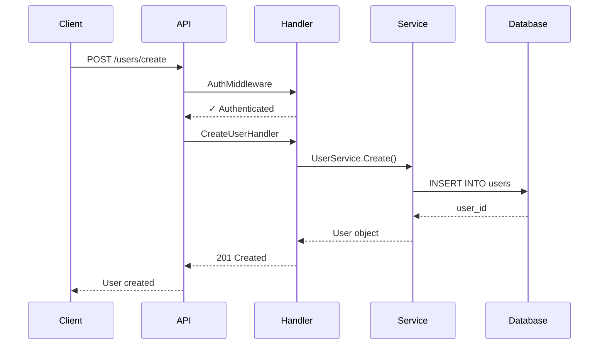
```mermaid
sequenceDiagram
    participant Client
    participant API
    participant Handler
    participant Service
    participant Database

    Client->>API: POST /users/create
    API->>Handler: AuthMiddleware
    Handler-->>API: ✓ Authenticated
    API->>Handler: CreateUserHandler
    Handler->>Service: UserService.Create()
    Service->>Database: INSERT INTO users
    Database-->>Service: user_id
    Service-->>Handler: User object
    Handler-->>API: 201 Created
    API-->>Client: User created
```

**Pattern:**
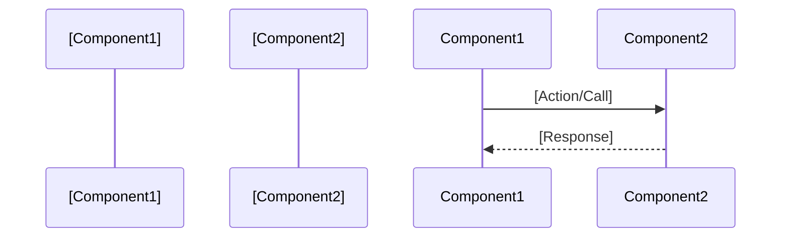
```mermaid
sequenceDiagram
    participant [Component1]
    participant [Component2]

    Component1->>Component2: [Action/Call]
    Component2-->>Component1: [Response]
```

#### Complex Flow with Multiple Services

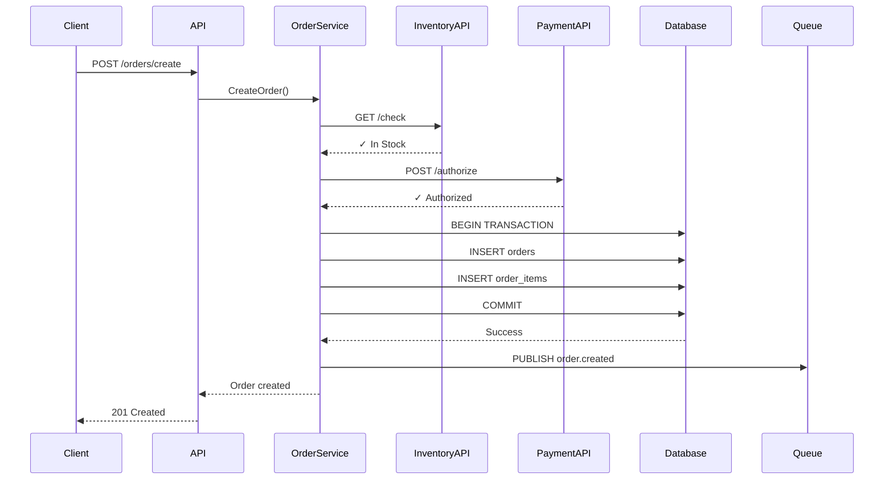
```mermaid
sequenceDiagram
    participant Client
    participant API
    participant OrderService
    participant InventoryAPI
    participant PaymentAPI
    participant Database
    participant Queue

    Client->>API: POST /orders/create
    API->>OrderService: CreateOrder()

    OrderService->>InventoryAPI: GET /check
    InventoryAPI-->>OrderService: ✓ In Stock

    OrderService->>PaymentAPI: POST /authorize
    PaymentAPI-->>OrderService: ✓ Authorized

    OrderService->>Database: BEGIN TRANSACTION
    OrderService->>Database: INSERT orders
    OrderService->>Database: INSERT order_items
    OrderService->>Database: COMMIT
    Database-->>OrderService: Success

    OrderService->>Queue: PUBLISH order.created

    OrderService-->>API: Order created
    API-->>Client: 201 Created
```

#### Flow with Conditional Logic

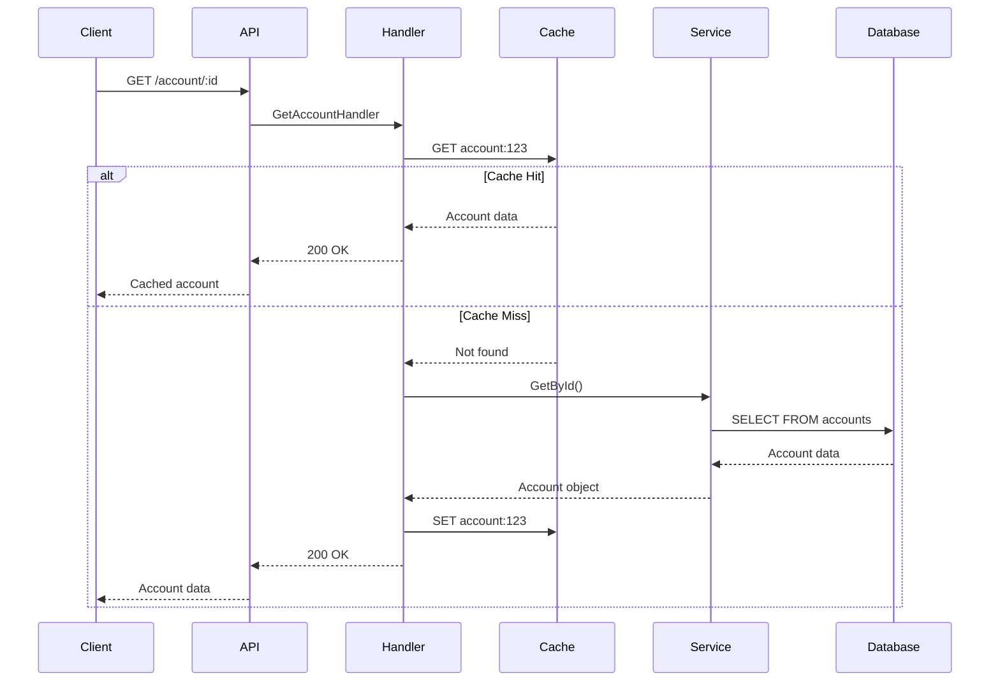
```mermaid
sequenceDiagram
    participant Client
    participant API
    participant Handler
    participant Cache
    participant Service
    participant Database

    Client->>API: GET /account/:id
    API->>Handler: GetAccountHandler
    Handler->>Cache: GET account:123

    alt Cache Hit
        Cache-->>Handler: Account data
        Handler-->>API: 200 OK
        API-->>Client: Cached account
    else Cache Miss
        Cache-->>Handler: Not found
        Handler->>Service: GetById()
        Service->>Database: SELECT FROM accounts
        Database-->>Service: Account data
        Service-->>Handler: Account object
        Handler->>Cache: SET account:123
        Handler-->>API: 200 OK
        API-->>Client: Account data
    end
```

**Alt/Else Pattern:**
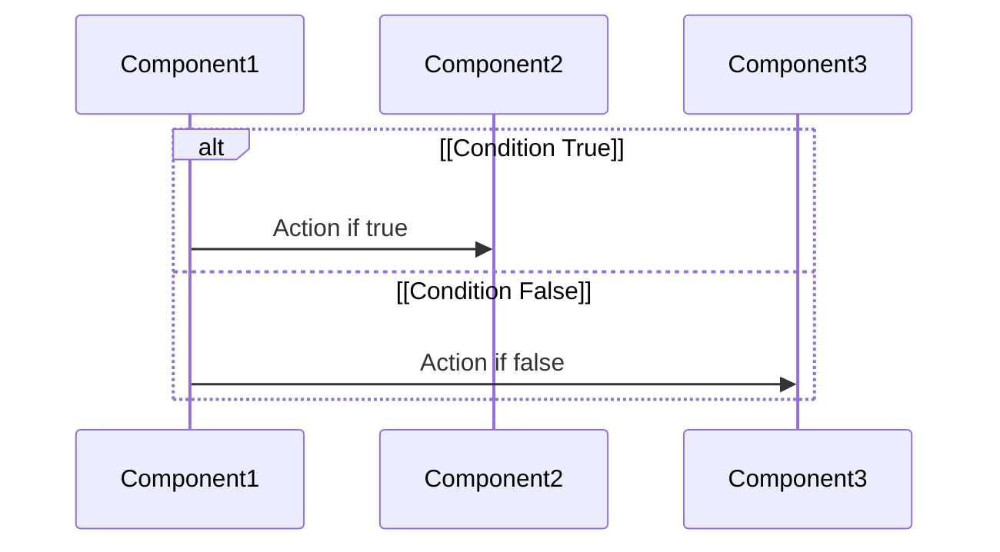
```mermaid
sequenceDiagram
    alt [Condition True]
        Component1->>Component2: Action if true
    else [Condition False]
        Component1->>Component3: Action if false
    end
```

#### Parallel/Concurrent Operations

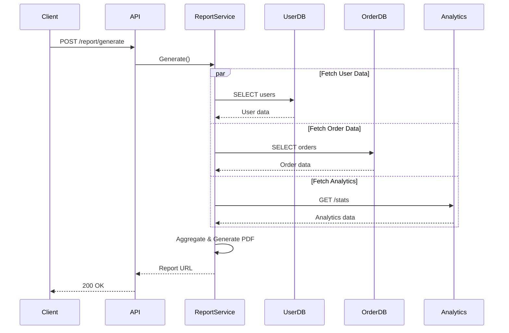
```mermaid
sequenceDiagram
    participant Client
    participant API
    participant ReportService
    participant UserDB
    participant OrderDB
    participant Analytics

    Client->>API: POST /report/generate
    API->>ReportService: Generate()

    par Fetch User Data
        ReportService->>UserDB: SELECT users
        UserDB-->>ReportService: User data
    and Fetch Order Data
        ReportService->>OrderDB: SELECT orders
        OrderDB-->>ReportService: Order data
    and Fetch Analytics
        ReportService->>Analytics: GET /stats
        Analytics-->>ReportService: Analytics data
    end

    ReportService->>ReportService: Aggregate & Generate PDF
    ReportService-->>API: Report URL
    API-->>Client: 200 OK
```

**Par Pattern:**
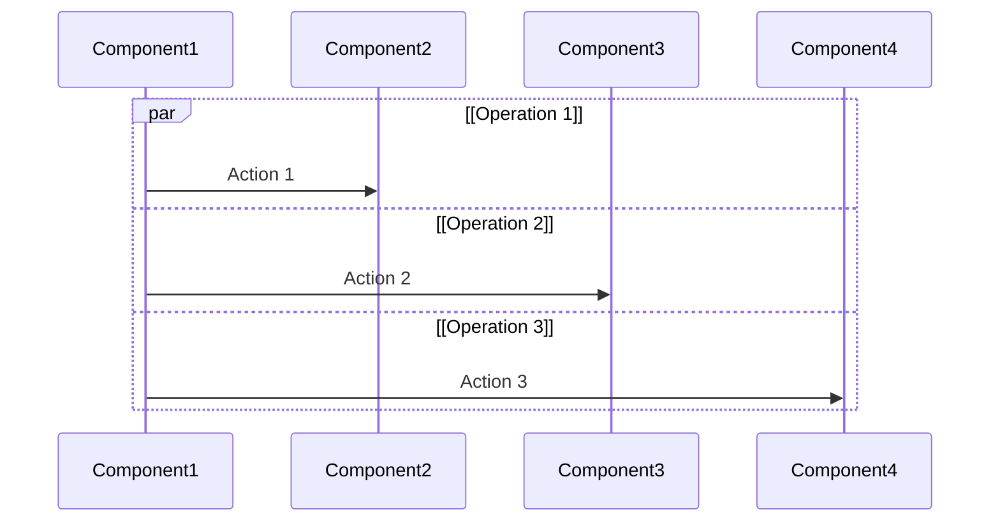
```mermaid
sequenceDiagram
    par [Operation 1]
        Component1->>Component2: Action 1
    and [Operation 2]
        Component1->>Component3: Action 2
    and [Operation 3]
        Component1->>Component4: Action 3
    end
```

#### Background Jobs & Async Processing

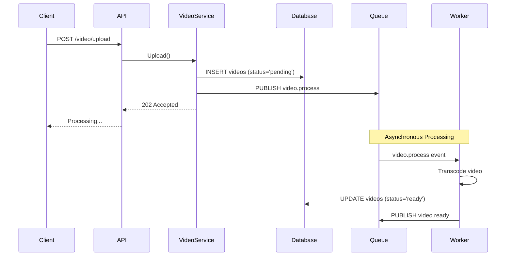
```mermaid
sequenceDiagram
    participant Client
    participant API
    participant VideoService
    participant Database
    participant Queue
    participant Worker

    Client->>API: POST /video/upload
    API->>VideoService: Upload()
    VideoService->>Database: INSERT videos (status='pending')
    VideoService->>Queue: PUBLISH video.process
    VideoService-->>API: 202 Accepted
    API-->>Client: Processing...

    Note over Queue,Worker: Asynchronous Processing

    Queue->>Worker: video.process event
    Worker->>Worker: Transcode video
    Worker->>Database: UPDATE videos (status='ready')
    Worker->>Queue: PUBLISH video.ready
```

**Note Pattern for Async:**
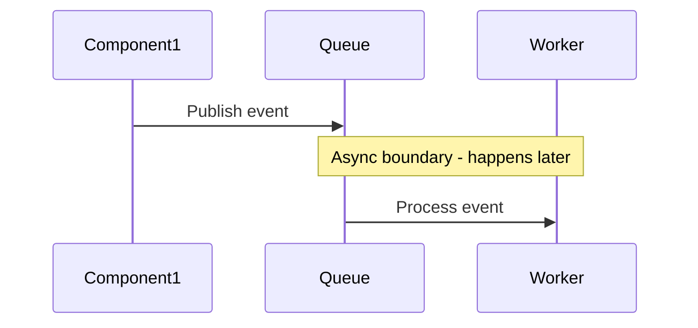
```mermaid
sequenceDiagram
    Component1->>Queue: Publish event

    Note over Queue,Worker: Async boundary - happens later

    Queue->>Worker: Process event
```

#### Error Handling Flow

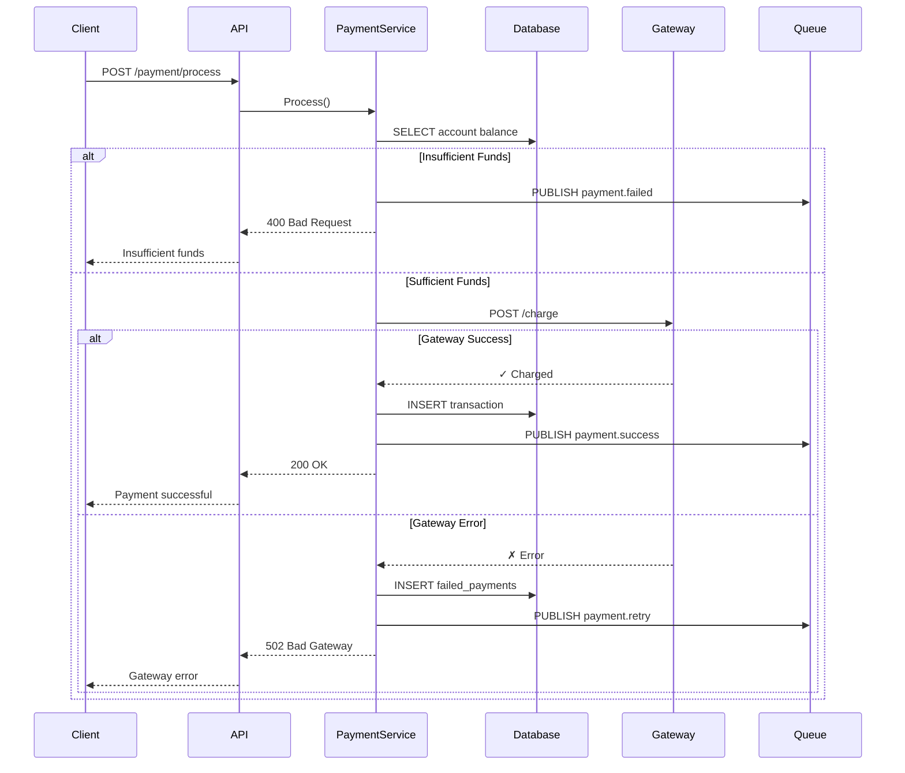
```mermaid
sequenceDiagram
    participant Client
    participant API
    participant PaymentService
    participant Database
    participant Gateway
    participant Queue

    Client->>API: POST /payment/process
    API->>PaymentService: Process()
    PaymentService->>Database: SELECT account balance

    alt Insufficient Funds
        PaymentService->>Queue: PUBLISH payment.failed
        PaymentService-->>API: 400 Bad Request
        API-->>Client: Insufficient funds
    else Sufficient Funds
        PaymentService->>Gateway: POST /charge

        alt Gateway Success
            Gateway-->>PaymentService: ✓ Charged
            PaymentService->>Database: INSERT transaction
            PaymentService->>Queue: PUBLISH payment.success
            PaymentService-->>API: 200 OK
            API-->>Client: Payment successful
        else Gateway Error
            Gateway-->>PaymentService: ✗ Error
            PaymentService->>Database: INSERT failed_payments
            PaymentService->>Queue: PUBLISH payment.retry
            PaymentService-->>API: 502 Bad Gateway
            API-->>Client: Gateway error
        end
    end
```

### 2. Flowchart (For Logic-Heavy Flows)

Best for showing decision trees and complex branching logic.

#### Payment Processing Logic

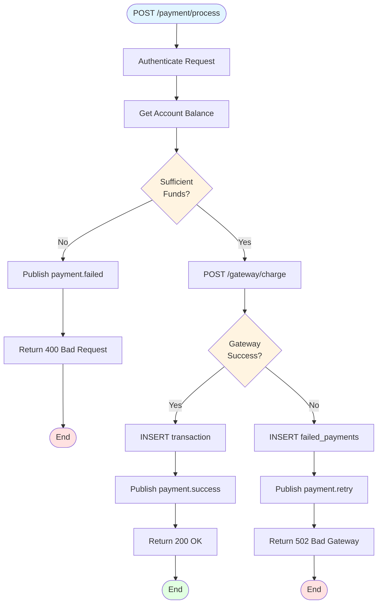
```mermaid
flowchart TD
    Start([POST /payment/process]) --> Auth[Authenticate Request]
    Auth --> GetBalance[Get Account Balance]
    GetBalance --> CheckBalance{Sufficient<br/>Funds?}

    CheckBalance -->|No| PublishFailed[Publish payment.failed]
    PublishFailed --> Return400[Return 400 Bad Request]
    Return400 --> End1([End])

    CheckBalance -->|Yes| ChargeGateway[POST /gateway/charge]
    ChargeGateway --> GatewayCheck{Gateway<br/>Success?}

    GatewayCheck -->|Yes| InsertTxn[INSERT transaction]
    InsertTxn --> PublishSuccess[Publish payment.success]
    PublishSuccess --> Return200[Return 200 OK]
    Return200 --> End2([End])

    GatewayCheck -->|No| InsertFailed[INSERT failed_payments]
    InsertFailed --> PublishRetry[Publish payment.retry]
    PublishRetry --> Return502[Return 502 Bad Gateway]
    Return502 --> End3([End])

    style Start fill:#e1f5ff
    style End1 fill:#ffe1e1
    style End2 fill:#e1ffe1
    style End3 fill:#ffe1e1
    style CheckBalance fill:#fff4e1
    style GatewayCheck fill:#fff4e1
```

**Flowchart Pattern:**
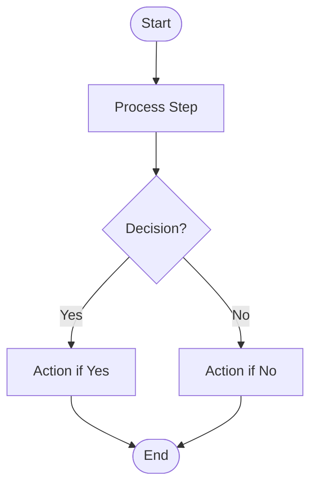
```mermaid
flowchart TD
    Start([Start]) --> Process[Process Step]
    Process --> Decision{Decision?}
    Decision -->|Yes| Action1[Action if Yes]
    Decision -->|No| Action2[Action if No]
    Action1 --> End([End])
    Action2 --> End
```

**Shape Legend:**
- `([Start/End])` - Rounded rectangle for start/end
- `[Process]` - Rectangle for processes
- `{Decision?}` - Diamond for decisions
- `[(Database)]` - Cylinder for databases
- `[[Subroutine]]` - Double rectangle for subroutines

#### Account Linking Flow

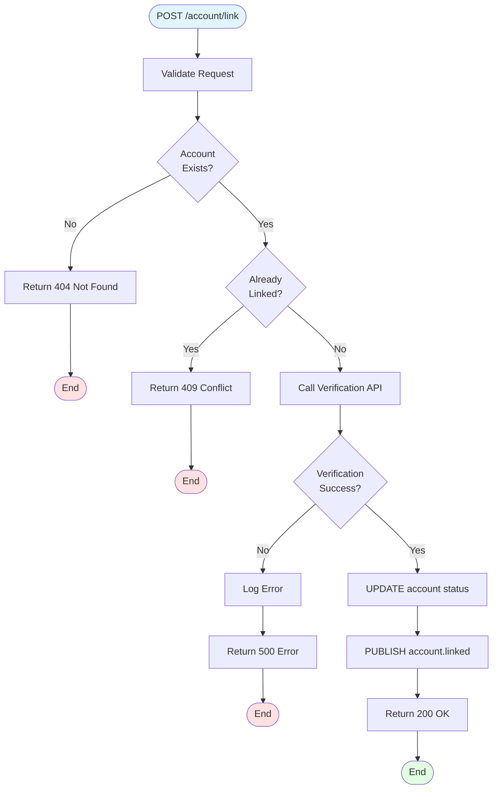
```mermaid
flowchart TD
    Start([POST /account/link]) --> ValidateReq[Validate Request]
    ValidateReq --> CheckExists{Account<br/>Exists?}

    CheckExists -->|No| Return404[Return 404 Not Found]
    Return404 --> End1([End])

    CheckExists -->|Yes| CheckStatus{Already<br/>Linked?}

    CheckStatus -->|Yes| Return409[Return 409 Conflict]
    Return409 --> End2([End])

    CheckStatus -->|No| CallVerify[Call Verification API]
    CallVerify --> VerifyCheck{Verification<br/>Success?}

    VerifyCheck -->|No| LogError[Log Error]
    LogError --> Return500[Return 500 Error]
    Return500 --> End3([End])

    VerifyCheck -->|Yes| UpdateDB[UPDATE account status]
    UpdateDB --> PublishEvent[PUBLISH account.linked]
    PublishEvent --> Return200[Return 200 OK]
    Return200 --> End4([End])

    style Start fill:#e1f5ff
    style End1 fill:#ffe1e1
    style End2 fill:#ffe1e1
    style End3 fill:#ffe1e1
    style End4 fill:#e1ffe1
```

### 3. Architecture/Component Diagram

Best for showing high-level system architecture.

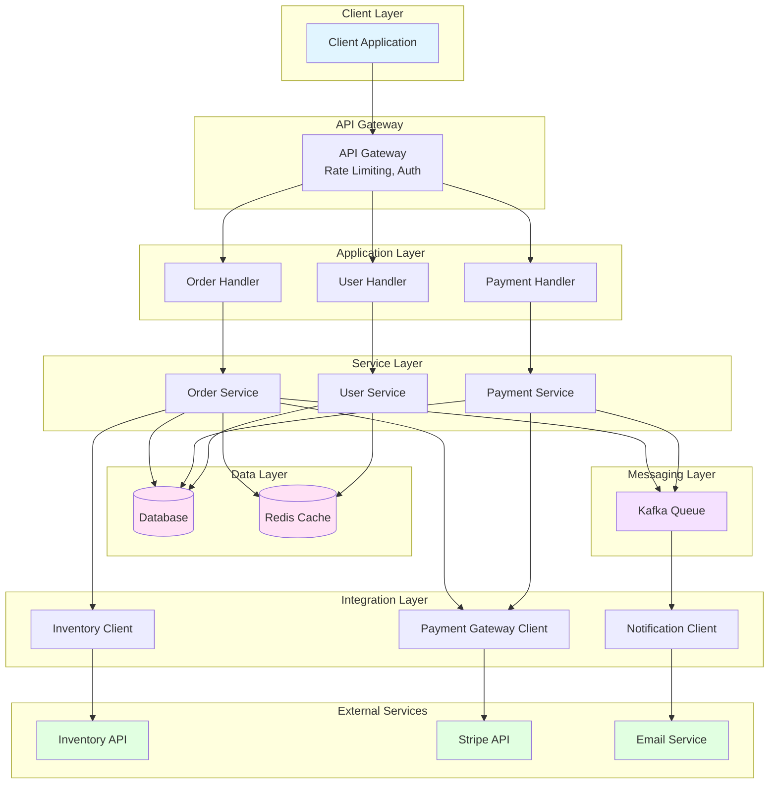
```mermaid
graph TB
    subgraph Client Layer
        Client[Client Application]
    end

    subgraph API Gateway
        Gateway[API Gateway<br/>Rate Limiting, Auth]
    end

    subgraph Application Layer
        Handler1[Order Handler]
        Handler2[User Handler]
        Handler3[Payment Handler]
    end

    subgraph Service Layer
        OrderSvc[Order Service]
        UserSvc[User Service]
        PaymentSvc[Payment Service]
    end

    subgraph Integration Layer
        InventoryClient[Inventory Client]
        PaymentGateway[Payment Gateway Client]
        NotificationClient[Notification Client]
    end

    subgraph Data Layer
        DB[(Database)]
        Cache[(Redis Cache)]
    end

    subgraph Messaging Layer
        Queue[Kafka Queue]
    end

    subgraph External Services
        Inventory[Inventory API]
        Stripe[Stripe API]
        Email[Email Service]
    end

    Client --> Gateway
    Gateway --> Handler1
    Gateway --> Handler2
    Gateway --> Handler3

    Handler1 --> OrderSvc
    Handler2 --> UserSvc
    Handler3 --> PaymentSvc

    OrderSvc --> DB
    OrderSvc --> Cache
    OrderSvc --> Queue
    OrderSvc --> InventoryClient
    OrderSvc --> PaymentGateway

    PaymentSvc --> DB
    PaymentSvc --> PaymentGateway
    PaymentSvc --> Queue

    UserSvc --> DB
    UserSvc --> Cache

    InventoryClient --> Inventory
    PaymentGateway --> Stripe
    NotificationClient --> Email

    Queue --> NotificationClient

    style Client fill:#e1f5ff
    style DB fill:#ffe1f5
    style Cache fill:#ffe1f5
    style Queue fill:#f5e1ff
    style Inventory fill:#e1ffe1
    style Stripe fill:#e1ffe1
    style Email fill:#e1ffe1
```

### 4. State Diagram (For State Transitions)

Best for showing state changes in entities.

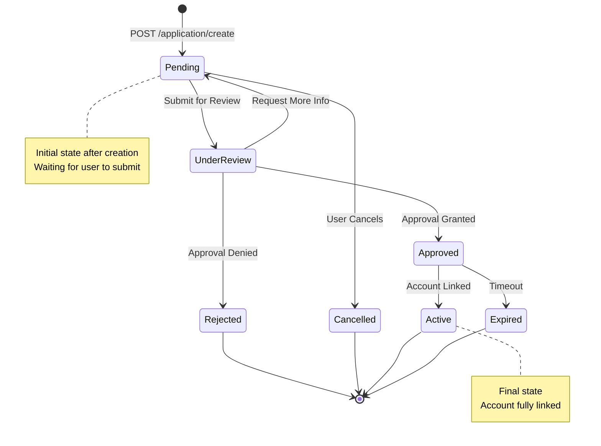
```mermaid
stateDiagram-v2
    [*] --> Pending: POST /application/create

    Pending --> UnderReview: Submit for Review
    Pending --> Cancelled: User Cancels

    UnderReview --> Approved: Approval Granted
    UnderReview --> Rejected: Approval Denied
    UnderReview --> Pending: Request More Info

    Approved --> Active: Account Linked
    Approved --> Expired: Timeout

    Rejected --> [*]
    Cancelled --> [*]
    Active --> [*]
    Expired --> [*]

    note right of Pending
        Initial state after creation
        Waiting for user to submit
    end note

    note right of Active
        Final state
        Account fully linked
    end note
```

## Best Practices for API Flow Mermaid Charts

### 1. Choosing the Right Diagram Type

| Diagram Type | Use When | Example |
|-------------|----------|---------|
| **Sequence Diagram** | Most API flows, showing request/response | GET /user, POST /order |
| **Flowchart** | Complex decision logic, multiple branches | Payment validation, multi-step approval |
| **Architecture Graph** | System overview, component relationships | Microservices architecture |
| **State Diagram** | Entity state transitions | Order status, Application workflow |

### 2. Naming Conventions

**Participants/Components:**
- Use clear, descriptive names
- Match actual architecture layers
- Examples: `Client`, `API Gateway`, `OrderService`, `Database`, `PaymentAPI`

**Actions:**
- Use verbs for operations: `Create()`, `Process()`, `Validate()`
- Include HTTP methods for API calls: `POST /users`, `GET /orders`
- Show success/failure: `✓ Success`, `✗ Error`

### 3. Detail Level

**High-Level (Mermaid):**
- Show main components only
- Group similar operations
- Focus on the "what", not the "how"
- Example: "Validate Request" instead of listing each validation

**Detailed (ASCII):**
- Include file paths and line numbers
- Show actual function names
- Include all operations
- Example: "ValidateRequest (validators/user.go:45)"

### 4. Color Coding (Optional)

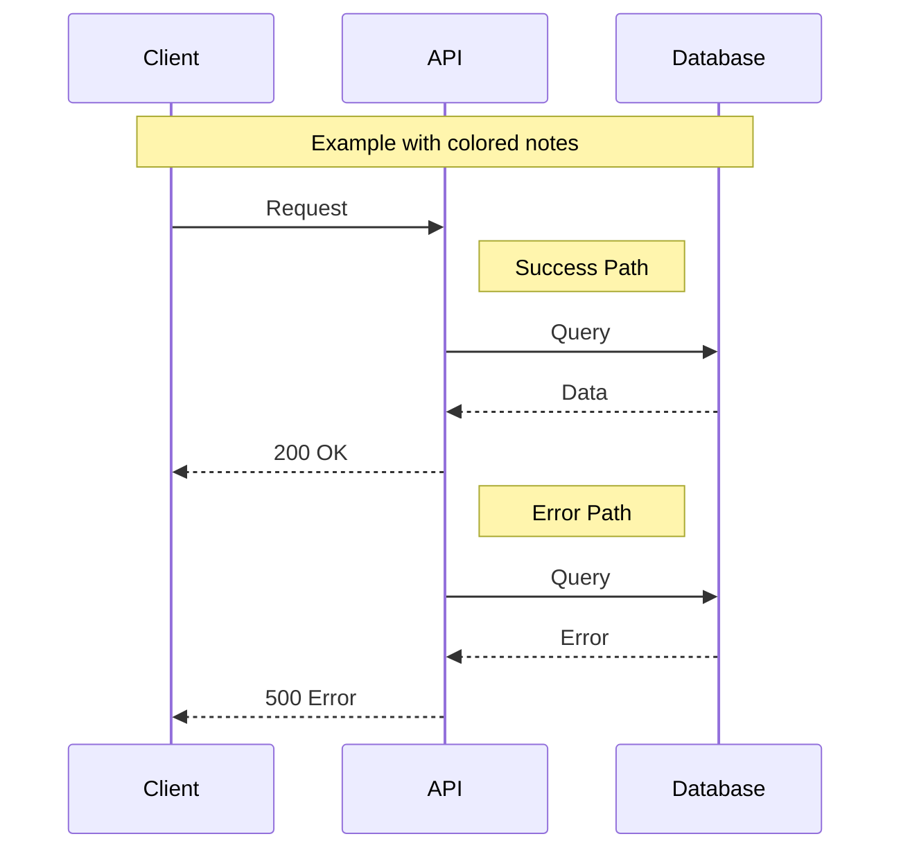
```mermaid
sequenceDiagram
    participant Client
    participant API
    participant Database

    Note over Client,Database: Example with colored notes

    Client->>API: Request

    Note right of API: Success Path
    API->>Database: Query
    Database-->>API: Data
    API-->>Client: 200 OK

    Note right of API: Error Path
    API->>Database: Query
    Database-->>API: Error
    API-->>Client: 500 Error
```

### 5. Annotations

Use notes to add context:

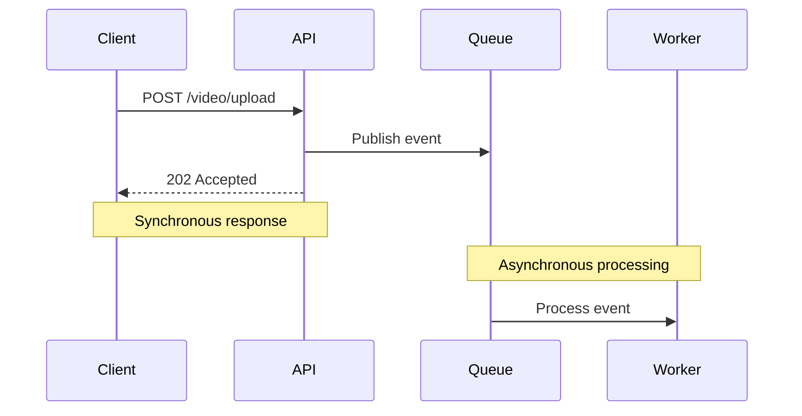
```mermaid
sequenceDiagram
    participant Client
    participant API
    participant Queue
    participant Worker

    Client->>API: POST /video/upload
    API->>Queue: Publish event
    API-->>Client: 202 Accepted

    Note over API,Client: Synchronous response
    Note over Queue,Worker: Asynchronous processing

    Queue->>Worker: Process event
```

## Template for API Endpoint

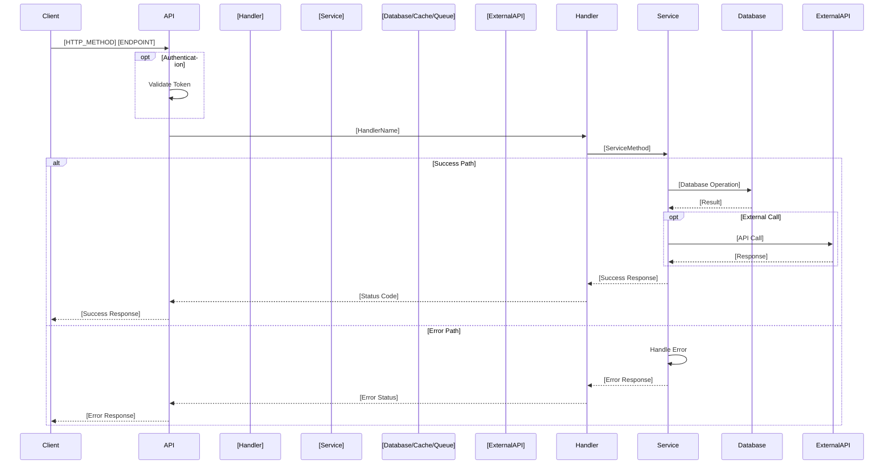
```mermaid
sequenceDiagram
    participant Client
    participant API
    participant [Handler]
    participant [Service]
    participant [Database/Cache/Queue]
    participant [ExternalAPI]

    Client->>API: [HTTP_METHOD] [ENDPOINT]

    opt Authentication
        API->>API: Validate Token
    end

    API->>Handler: [HandlerName]
    Handler->>Service: [ServiceMethod]

    alt Success Path
        Service->>Database: [Database Operation]
        Database-->>Service: [Result]

        opt External Call
            Service->>ExternalAPI: [API Call]
            ExternalAPI-->>Service: [Response]
        end

        Service-->>Handler: [Success Response]
        Handler-->>API: [Status Code]
        API-->>Client: [Success Response]
    else Error Path
        Service->>Service: Handle Error
        Service-->>Handler: [Error Response]
        Handler-->>API: [Error Status]
        API-->>Client: [Error Response]
    end
```

## Output Format

Always provide Mermaid charts in a code block with the `mermaid` language identifier:

````markdown
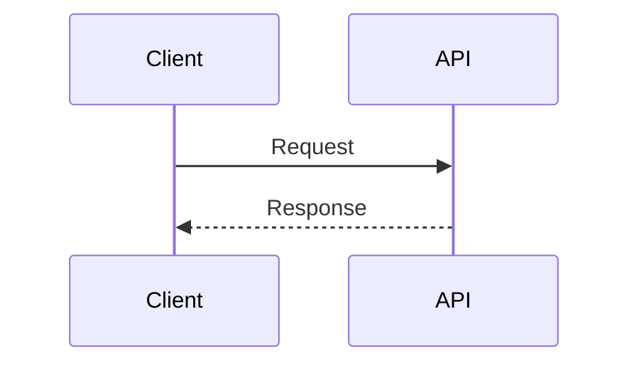
```mermaid
sequenceDiagram
    participant Client
    participant API

    Client->>API: Request
    API-->>Client: Response
```
````

This allows the chart to be rendered in:
- GitHub README files
- GitLab documentation
- Notion pages
- Mermaid Live Editor
- VS Code with Mermaid extension
- Many other tools

## Combining ASCII and Mermaid

**Recommended Output Structure:**

1. **High-Level Mermaid Sequence Diagram** - Quick overview
2. **Detailed ASCII Sequence Diagram** - Full details with file paths
3. **Optional Mermaid Flowchart** - If complex decision logic exists
4. **File References** - List of all files involved
5. **Summary** - Key components, external dependencies, potential bottlenecks

This gives developers both a quick overview (Mermaid) and detailed implementation view (ASCII).
