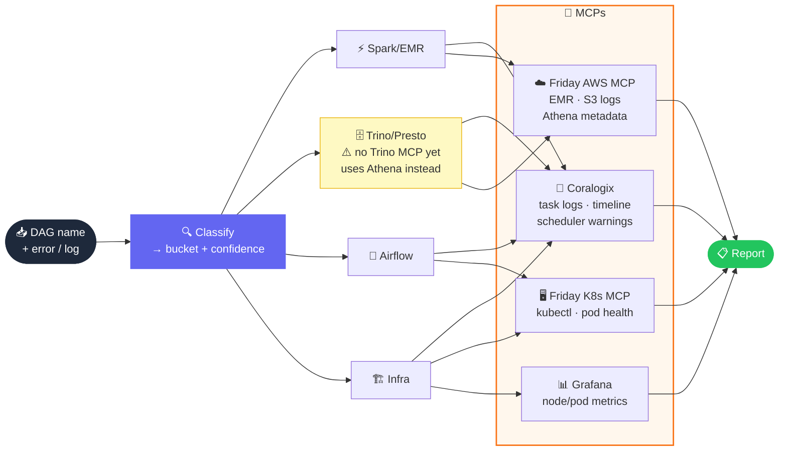

# Query DAG Failure Debugger

**Triages and investigates Airflow DAG failures across ~3000 DAGs. Give it an error message or log snippet — it classifies, explains, and deep-dives with live data. Zero credential setup required.**

---

## How It Works

---

## Features at a Glance

| | |
|---|---|
| **Buckets** | 9 — across Spark/EMR, Trino/Presto, Airflow, Infra |
| **Confidence** | HIGH / MEDIUM / LOW, evidence-grounded |
| **Regression check** | Proactive `git log` + last successful run — no asking |
| **MCP-powered** | Friday AWS MCP (EMR/S3/Athena) · Coralogix · Grafana · Friday K8s MCP |
| **Output** | Slack triage block — bucket, confidence, root cause, owners |
| **Scope** | ~3000 DAGs · airflow-dags monorepo · AWS ap-south-1 |
